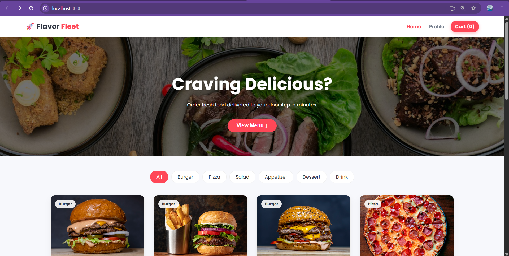
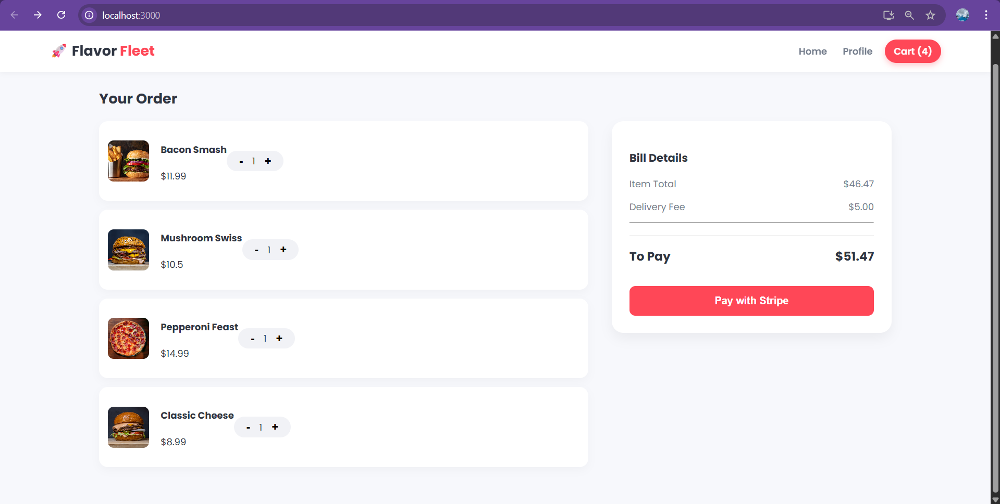

# 🍔 Food Ordering App

> A full-stack food delivery application built with the MERN stack (MongoDB, Express, React, Node.js). Users can browse menus, add items to a cart, and place orders seamlessly.


<!-- Replace the link above with a screenshot of your Home Page later -->

## 🚀 Live Demo
<!-- If you have deployed it, put the link here. If not, delete this section or say "Coming Soon" -->
- [View Live Demo](#)

## ✨ Features

- **User Authentication**: Secure login and signup (JWT/Firebase/Auth0).
- **Browse Food**: Dynamic menu categories and food items.
- **Cart Management**: Add, remove, and adjust quantities in real-time.
- **Order System**: Checkout process with order summary.
- **Responsive Design**: Works on mobile and desktop.
- **Admin Panel**: (If you have one) Manage food items and orders.

## 🛠️ Tech Stack

- **Frontend:** React.js, Redux (or Context API), CSS Modules/Tailwind
- **Backend:** Node.js, Express.js
- **Database:** MongoDB, Mongoose
- **Tools:** Git, Postman, VS Code

## 📸 Screenshots

| Home Page | Menu Page |
|:---:|:---:|
|  |  |

| Shopping Cart | Checkout |
|:---:|:---:|
|  |  |

<!-- create a folder named 'screenshots' in your root and put images there -->

## 💻 Installation & Run Locally

**1. Clone the repository**
```bash
git clone https://github.com/Avinab0813/food-ordering-app.git
cd food-ordering-app