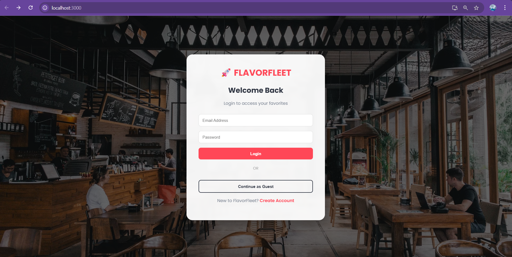

# 🚀 FlavorFleet - Modern Food Ordering Platform

<div align="center">

  
  
  
  
  

  <br />
  
  **A full-stack MERN application delivering a seamless food ordering experience with real-time tracking, secure payments, and a professional UI.**

  [**🔴 View Live Demo**](https://your-vercel-link-here.vercel.app)
  
</div>

---

## 📸 Project Screenshots

<div align="center">

| **Home Page & Menu** | **Shopping Cart** |
|:---:|:---:|
|  |  |

| **Secure Login** | **Admin Dashboard** |
|:---:|:---:|
|  | *Admin view* |

</div>

---

## ✨ Key Features

- **🍔 Dynamic Menu System:** Browse food items filtered by categories (Burgers, Pizza, Drinks, etc.).
- **💳 Secure Payments:** Integrated **Stripe Gateway** for safe and instant transactions.
- **🛒 Smart Cart:** Add/remove items with automatic total calculation and delivery fees.
- **🛵 Real-Time Tracking:** Live order updates (Preparing -> Out for Delivery -> Delivered) using **Socket.io**.
- **📱 Responsive UI:** Fully optimized for Desktop, Tablet, and Mobile devices.

---

## 🛠 Tech Stack

| Component | Technology |
| :--- | :--- |
| **Frontend** | React.js, CSS3, React Router |
| **Backend** | Node.js, Express.js |
| **Database** | MongoDB Atlas (Cloud) |
| **Payment** | Stripe API |
| **Real-Time** | Socket.io (WebSockets) |
| **Deployment** | Vercel (Frontend) + Render (Backend) |

---

## 🚀 Getting Started

### Prerequisites
Make sure you have **Node.js** installed on your machine.

### 1. Clone the Repository
```bash
git clone https://github.com/YOUR_USERNAME/food-ordering-app.git
cd food-ordering-app